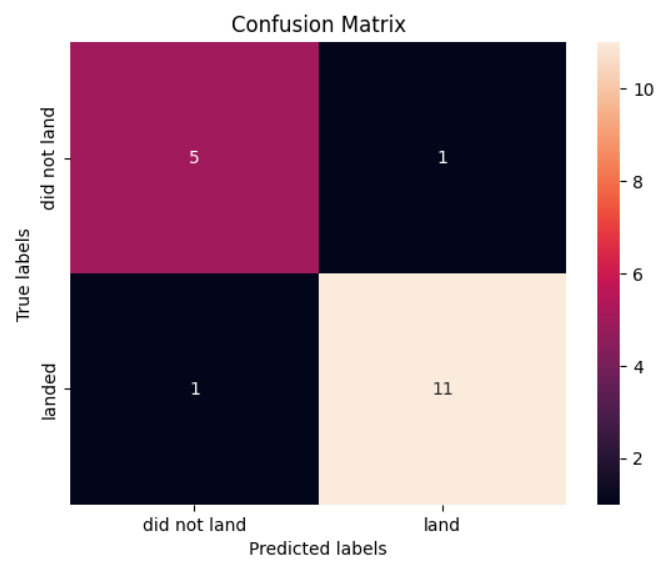

# SpaceX Falcon 9 First Stage Landing Prediction
_This project is my Capstone Project for the IBM Data Science Professional Certificate._

_This project demonstrates end-to-end data science skills including data collection, wrangling, EDA, visualization, and machine learning. The final model achieves ~83% accuracy and provides an interactive dashboard for business insights._

## Overview
SpaceX advertises Falcon 9 rocket launches on its website with a cost of 62 million dollars; other providers cost upward of 165 million dollars each, much of the savings is because SpaceX can reuse the first stage. Predicting whether the first stage will successfully land plays a crucial role in determining the overall launch cost. Leveraging publicly available data and machine learning models. 

The objective is to **predict whether the Falcon 9 first stage will land successfully**

## Project Workflow

1. **Data Collection**  
   - SpaceX REST API for detailed launch and booster data  
   - Web scraping from Wikipedia for historical data  

2. **Data Wrangling**  
   - Handling missing values and inconsistent records  
   - Feature engineering and categorical encoding  

3. **Exploratory Data Analysis (EDA)**  
   - Data visualizations with Matplotlib, Seaborn, and Plotly  
   - SQL analysis with SQLite for deeper insights  

4. **Interactive Analysis**  
   - **Folium maps** to visualize SpaceX launch sites  
   - **Plotly Dash dashboard** to explore launch outcomes by payload, orbit, and site  

5. **Predictive Modeling**  
   - Machine Learning models: Logistic Regression, Decision Trees, SVM, KNN  
   - Hyperparameter tuning with GridSearchCV  
   - Achieved **~83% accuracy** on test data

## Project Structure 

```
spacex-falcon9-landing-prediction/
│
├── data/                  # Small cleaned datasets
│   ├── dataset_part_1.csv  
│   ├── dataset_part_2.csv
│   ├── dataset_part_3.csv
│   ├── spacex_web_scraped.csv
│   └── spacex_launch_dash.csv
│
├── notebooks/             # Jupyter notebooks
│   ├── 1_data_collection.ipynb
│   ├── 2_data_wrangling.ipynb
│   ├── 3_EDA_visualization.ipynb
│   ├── 4_EDA_SQL.ipynb
│   ├── 5_folium_map.ipynb
│   ├── 6_dashboard_plotly_dash.ipynb
│   └── 7_predictive_analysis.ipynb
│
├── images/                # Contains Screenshots 
│
├── dashboard/             # Final Plotly Dash app code
│   └── app.py           
│
├── reports/               # Project report & presentation
│   └── presentation.pdf
│
├── .gitignore            
├── LICENSE                
├── README.md              
└── requirements.txt
``` 

## Dashboard 

- Plotly dash Dashboard shows:
    - Pie chart: Displays total successful launches across all sites.
    - Scatter Chart: Shows the correlation between outcome (success or not) and payload mass.


## Map Visuals
- **Insights:**
   - Launch Site KSC LC-39A stands out with a high success rate, evident from the predominance of green markers
- **Color Representation:**
   - Green Marker: Indicates a successful launch.
   - Red Marker: Denotes a failed launch

#### VAFB SLC-4E 

#### KSC LC-39A 

#### CCAFS LC-40 & CCAFS SLC-40


## Results
- Best performing model: **Decision Tree** (tuned with GridSearchCV)  
- Test Accuracy: **88.8%**  
- Key factors influencing landing success:
  - Launch Site  
  - Payload Mass  
  - Booster Version  
  - Orbit Type

#### Confusion Matrix

  
## How to Run This Project

1. Clone the repository:
```bash
git clone https://github.com/Shubham-Rathore08/spacex_falcon9_first_stage_landing_prediction.git
```
2. Install dependencies:
```bash
pip install -r requirements.txt
```
3. Open and run notebooks:
   - `notebooks/jupyter-labs-spacex-data-collection-api.ipynb`
   - `notebooks/jupyter-labs-webscraping.ipynb`
   - `notebooks/jupyter-labs-spacex-data-wrangling.ipynb`
   - `notebooks/jupyter-labs-eda-sql.ipynb`
   - `notebooks/EDA-data-visualization.ipynb`
   - `notebooks/folium_viz.ipynb`
   - `notebooks/spacex_ML_prediction.ipynb`
     
4. Run the Plotly Dash dashboard:
   - The dashboard uses a preprocessed dataset spacex_launch_dash.csv (already provided in `data/`)
   - To start the dashboard:
        - dashboard/app.py


## Author & Contact
**Shubham Rathore**
📧 Email: shubhamrathore7078@gmail.com
